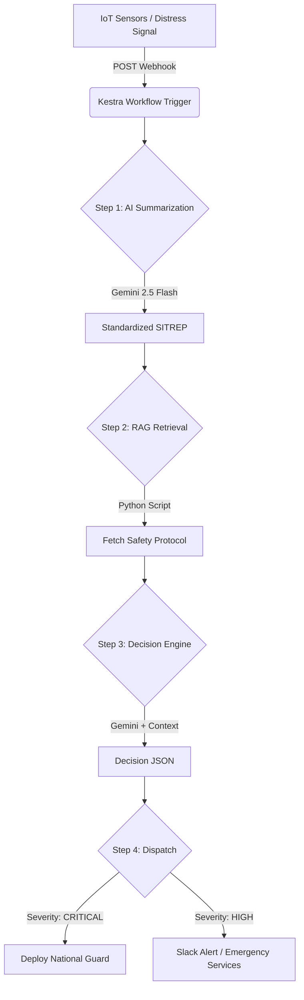

# 🛡️ ResQ-AI Command
### Autonomous Disaster Response & RAG Orchestration System

**"When milliseconds matter, ResQ-AI coordinates the chaos."**

---

## 🚨 The Problem
In modern disaster scenarios, command centers are overwhelmed by massive streams of data: IoT sensor logs, drone telemetry, and distress signals. Human operators cannot manually correlate this raw data with complex safety protocols fast enough to save lives efficiently.

## 💡 The Solution
**ResQ-AI Command** is an **Event-Driven AI Agent** system that autonomously:
1.  **Ingests** raw, unstructured telemetry via Webhooks.
2.  **Standardizes** data using Multimodal AI (Gemini).
3.  **Retrieves** precise emergency protocols via RAG (Retrieval Augmented Generation).
4.  **Orchestrates** physical response assets using **Kestra**.

---

## 🛠️ Sponsor Technologies & Implementation

### 1. 🌩️ Kestra (Orchestration & Event-Driven Architecture)
*Submitted for the **Stormbreaker Deployment Award**.*

We utilize Kestra not just as a scheduler, but as the **central nervous system** of our application.
*   **Event-Driven Trigger**: The workflow is triggered via a `Webhook` (`io.kestra.plugin.core.trigger.Webhook`), allowing external IoT systems to wake up the agent instantly.
*   **Hybrid Variable Resolution**: We implemented smart variable logic that prioritizes real-time payload data (`trigger.body`) but falls back to manual inputs for testing (`inputs`), ensuring robust deployment.
*   **Polyglot Pipeline**:
    *   `Gemini Chat` task for summarization.
    *   `Python Script` task for vector search/RAG logic.
    *   `Flow Switch` task for conditional resource dispatching based on severity.

### 2. 🧠 Google Gemini (Intelligence Layer)
We leverage **Gemini 2.5 Flash** via the `@google/genai` SDK for high-speed reasoning.
*   **Data Normalization**: Converts raw JSON/Hex dumps from sensors into human-readable Situation Reports (SITREPs).
*   **Decision Engine**: Acts as the "Incident Commander," analyzing the SITREP against the retrieved safety protocols to determine severity and resource allocation.

---

## ⚙️ Architecture Flow



## 🚀 Features
*   **Real-time Monitoring Dashboard**: React-based UI visualizing incoming signals and workflow states.
*   **One-Click Kestra YAML Generation**: Automatically generates deployable Kestra workflow definitions based on the active incident context.
*   **Simulated RAG**: Demonstrates how AI agents fetch "proprietary" protocol data (e.g., Chemical Spill procedures) to ground their decisions.
*   **Production-Ready**: Configured for Vercel deployment with SPA rewriting.

## 📦 How to Run

1.  **Clone the repository**
2.  **Install dependencies**:
    ```bash
    npm install
    ```
3.  **Set up Environment**:
    Create a `.env` file with your Gemini API Key:
    ```
    API_KEY=your_google_api_key_here
    ```
4.  **Run Development Server**:
    ```bash
    npm start
    ```

## 🏆 Hackathon Tracks
*   **AI Agents Assemble**: Full autonomous agent workflow.
*   **Kestra**: **Stormbreaker Deployment Award**. We focused on a robust, event-driven architecture using Webhooks and dynamic variable resolution to simulate a real-world deployed environment.

---
*Built with ❤️ for the AI Agents Assemble Hackathon.*
